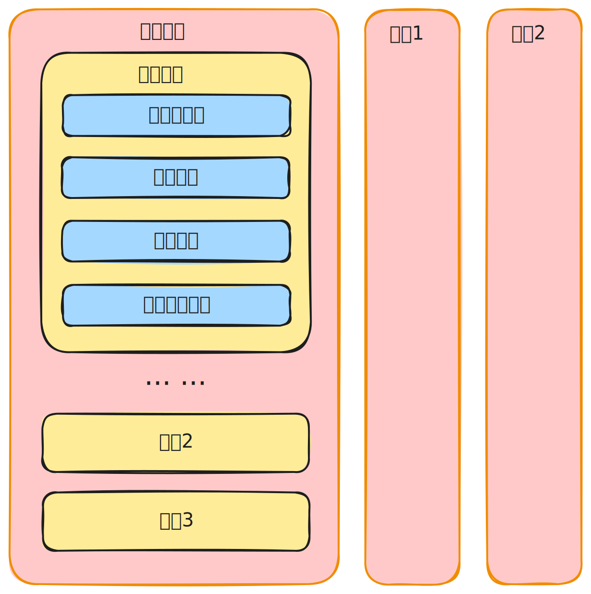

JVM 基于栈的设计模式。

<!--more-->

## JVM 基于栈的设计模式

JVM 的指令集是基于栈而不是基于寄存器的，这样具有很好的跨平台性。

如上图所示，线程中执行一个方法时，我们会创建一个栈帧入栈执行。如果该方法调用另外一个方法时会再次创建新的栈帧入栈，方法返回时，原栈帧会返回方法的执行结果给之前的栈帧，随后虚拟机将会丢弃此栈帧。

### 局部变量表

每个栈帧中包含**局部变量表**，用于存储方法参数和方法内定义的局部变量。局部变量中除了方法的参数，还包括 `this` 这个参数。

### 操作数栈

通过操作数栈，我们可以对局部变量表中要操作和待更新的数据进行操作。当一个方法开始执行时，其操作数栈是空的，随着方法的执行和字节码指令的执行，会从局部变量表或对象实例的字段中复制常量或变量写入到操作数栈，再随着计算的进行将栈中元素出栈到局部变量表或者返回给方法调用者，也就是**出栈/入栈**操作。

